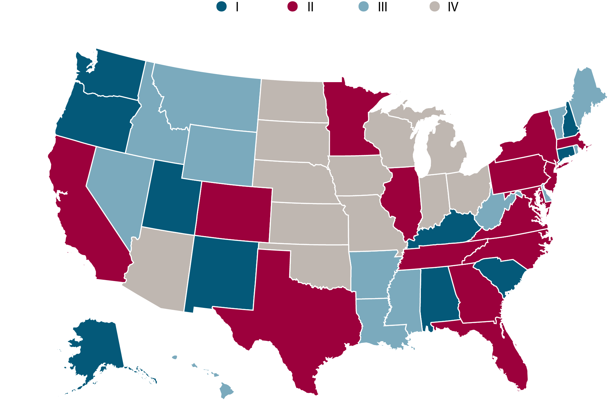

# Visualization of the Trade History between China and U.S. States

This project aims to use various visualization techniques and machine learning methods to study the history of trade between China and U.S. states. To achieve this goal, we analyzed the data from different sources, performed manifold learning-based clustering analysis, and created the best visualizations to illustrate our results. We hope that these visualizations and insights gained in our analyses can help us understand the trend of the U.S.-China trade and provide us some clues on the possible impact of the trade war on individual U.S. states.

