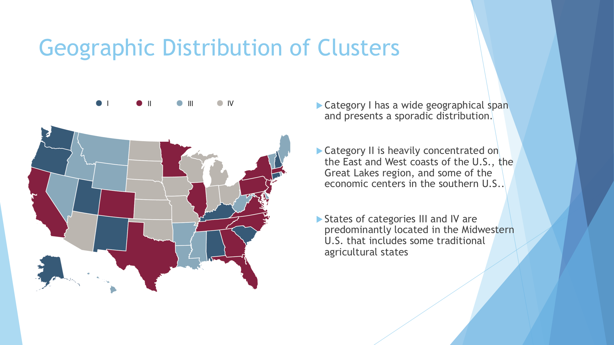

# Visualization of the Trade History between China and U.S. States

This project aims to use various visualization techniques and machine learning methods to study the history of trade between China and U.S. states. To achieve this goal, we analyzed the data from different sources, performed manifold learning-based clustering analysis, and created the best visualizations to illustrate our results. We hope that these visualizations and insights gained in our analyses can help us understand the trend of the U.S.-China trade and provide us some clues on the possible impact of the trade war on individual U.S. states.

A manifold learning model (Uniform Manifold Approximation and Projection: UMAP) was built using a dataset that included a number of export-related economic data (e.g. economic aggregates (GDP), exports to major trading partners and their fractions, exports to China and their fractions), as well as geographical location and political oriention of individual U.S. states. The optimal clustering was achieved with n_neighbor = 3 and min-dist = 0.001, which successfully yielded 4 meaningful structures of U.S. state clusters.

-	Category I: Washington, South Carolina, Oregon, Alabama, Kentucky, Puerto Rico, New Mexico, Alaska, Connecticut, Utah, New Hampshire
-	Category II: Texas, California, New York, Illinois, Georgia, Massachusetts, Pennsylvania, Tennessee, North Carolina, Minnesota, Florida, New Jersey, Virginia, Maryland, Colorado
-	Category III: Louisiana, Nevada, Mississippi, West Virginia, Idaho, Delaware, Arkansas, Maine, Vermont, Rhode Island, Montana, Wyoming, Hawaii, District of Columbia
-	Category IV: Ohio, Michigan, Indiana, Wisconsin, Arizona, Missouri, Kansas, Iowa, Nebraska, Oklahoma, South Dakota, North Dakota

---
[Detailed report](https://github.com/DongL/Data-Visualization/blob/master/Dviz%20Project%20Report.pdf)
